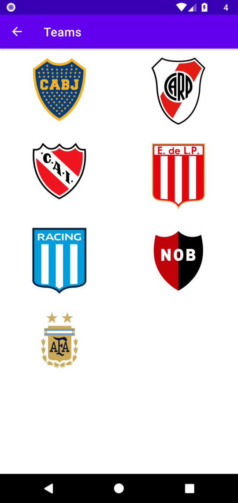
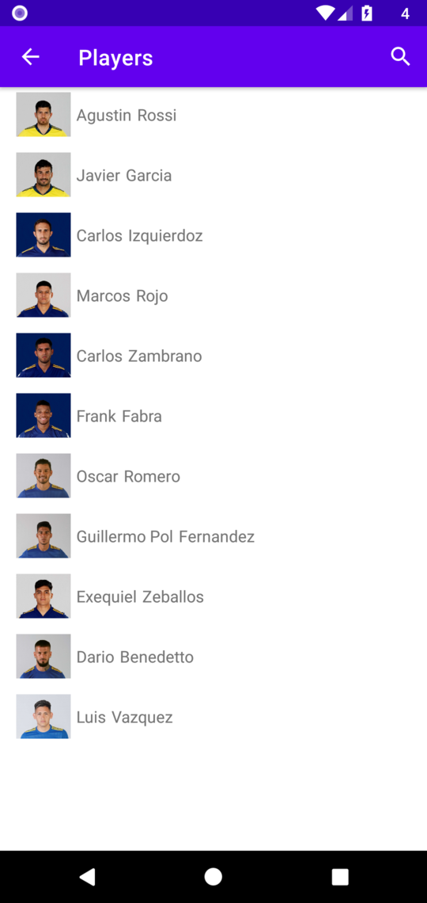
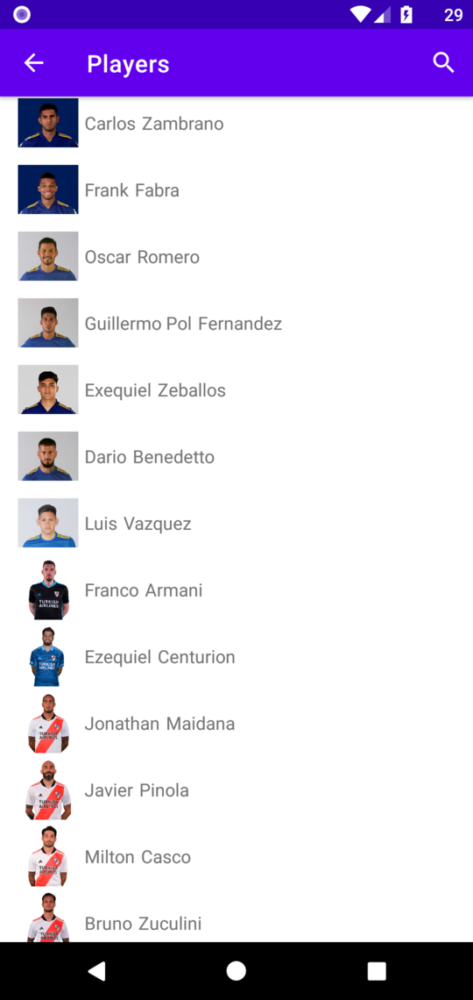
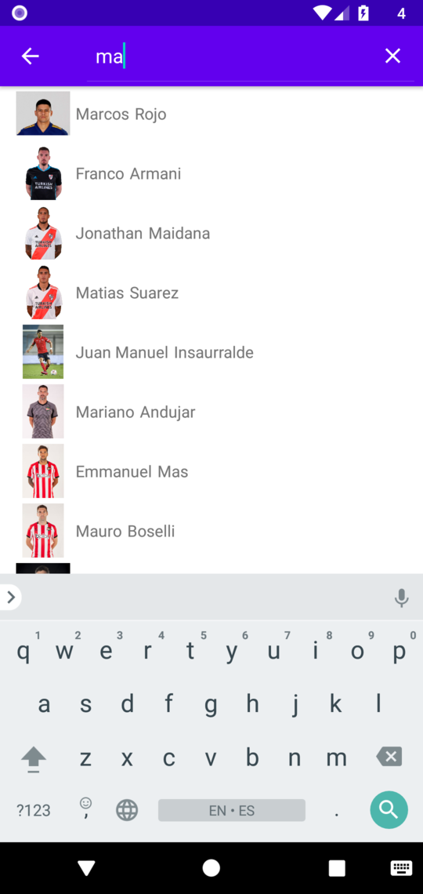
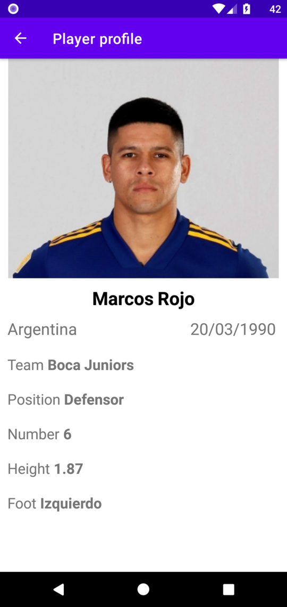

# TP Laboratorio V

Applicacion realizada en Android studio con java para la materia Laboratorio V de la Tecnicatura Universitaria en Sistemas Informaticos de la UTN Fra

El objetivo es consumir de una [Api Rest](https://github.com/PedroS2001/apiequipos) propia.\
Lograr mostrar los datos dentro de un RecyclerView, esperando que entren en pantalla para ir a buscar su imagen. \
Utilizar un SearchView.\
Comunicacion entre Activities.
## Authors

- [@PedroS2001](https://www.github.com/PedroS2001)

## Screenshots

#### Activity principal. Equipos

#### Todos los jugadores de un equipo

#### Todos los Jugadores

#### Filtrando los jugadores

#### Perfil del jugador

